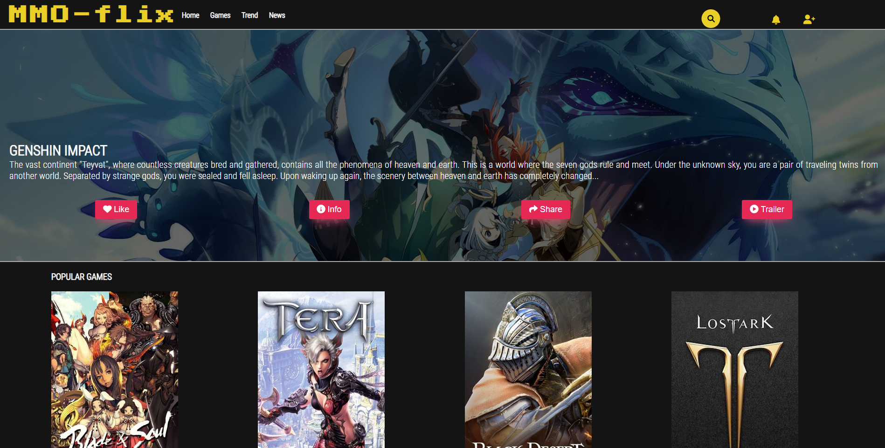
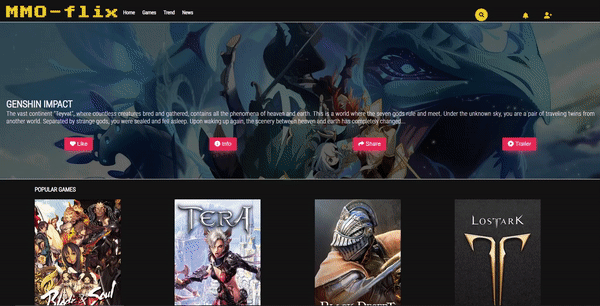

# Projeto-Netflix
Projeto baseado no site Netflix, reacriado como site de informações e videos de jogos. Criação de Karime Linhares. @felipeAguiarCode, @DigitalInnovationOne.

# Projeto baseado no site Netflix

  

Este projeto foi realizado com base no site "Netflix", desafio então proposto pelo bootcamp Impulso. Busqyei usar de minha criatividade e trazer um assunto da qual gosto muito que são os jogos RPG. E portando, o projeto funciona como uma plataforma para ver notícias e videos de jogos então lançados e que estão para ser lançados.

Me utilizei de ferramentas HTML, CSS, JavaScript para sua construção. Focando assim na proposta do desafio em focar no Front End.

  

## Header

  

No header, tentei usar uma fonte diferente assim como as fontes do restante do site, importadas do google-fontes, Usei de hover nos ícones da nav, assim como search bar. O último ícone seria o formulário para incrição no site. No formulário consta as caixas de email, senha e login funcionando, assim como o link para uma nova inscrição.

## Banner principal

  

O banner é estático, (mas sim, poderia ser um banner móvel também) usando uma imagem que chama-se atenção para os butões de like, share, trailer e info sobre o determinado jogo. Todos os botões possuem animação quando o usuário interage com eles.

## Main 

  

Assim como no netflix existem imagens dos vídeos com animação de zoom ao interagir com eles, utilizei o carrosel para mostrar as covers dos jogos. Todos possuem animações, sendo que fiz o primeiro carrosel de jogos existentes, portanto na interação, aparece o simbolo de play, no qual iria mostrar um video do jogo ao clicar. No de baixo, seriam jogos que ainda serão lançados, portanto, aparece um popup onde estariam as notícias daquele determinado jogo.

# Considerações

Devo dizer que gostei muito de realizar esse projeto, e poder não só mostrar minhas habilidades como despertar minha curiosidade e criatividade. Agradeço então à @felipeAguiarCode, Dio e a Impulso por estar pela oportunidade.
